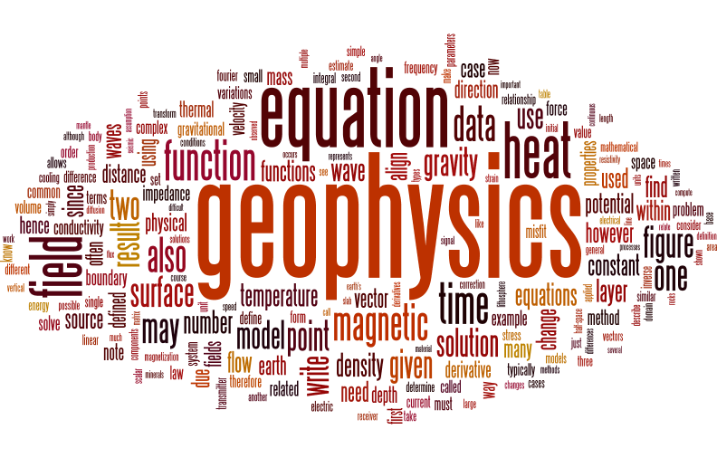

# EART 3017 - Geophysics 3A: Potential Fields and Geothermics

This repository contains source code files used for the Geophysics 3A course at Adelaide University.  The codes includes interactive VS Code demos, GUIs for calculator-like computations, supporting codes and other files required for assignments.

## Course description

Geophysics provides a window into the parts of the Earth that we cannot directly see, touch, or drill. This course introduces the theoretical foundations of gravity, magnetic, and thermal fields, and shows how these fields are used to investigate Earth’s internal structure and physical properties. Classic analytical solutions are used to develop physical intuition and provide a framework for interpreting the complexities of real world observations.

In parallel with the theoretical material, students gain practical experience in forward and inverse modelling, visualisation, and interpretation through a series of computer based laboratories. The course is designed for students from a range of numerate scientific backgrounds, including geoscience, physics, engineering, mathematics, and computer science.

## Learning outcomes
- Explain conceptually and quantitatively how gravity, magnetic, and thermal fields arise from variations in Earth structure and composition, and how these variations influence surface observations.
- Evaluate the assumptions and limitations of analytical geophysical models and identify the conditions under which they are applicable.
- Analyse mathematical descriptions of geophysical fields to identify characteristic spatial and temporal scales and understand how geometry and physical properties control anomaly behaviour.
- Develop and use computational forward models of geophysical fields to explore sensitivity, scaling, and non uniqueness using idealised and synthetic scenarios.
- Communicate geophysical results with reproducible workflows in class discussions, practical reports, and code notebooks, both individually and as part of groups.

## Week by week structure
### Unit 1 – Basic Geophysics
- Week 1 – Introduction to Geophysics and Potential Fields 
- Week 2 – Physical properties of Earth materials 
- Week 3 – Inverse theory: linear and non-linear methods

### Unit 2 – Gravity and Magnetics
- Week 4 – Basic Gravity and Density
- Week 5 – Gravity Anomalies and Isostasy 
- Week 6 – Magnetics and Magnetic Properties
- Week 7 – Application of Fourier Methods to Potential Fields 

### Unit 3 – Geothermics
- Week 8 – Steady-state Heat Flow and Continental Geotherms
- Week 9 – Transient Heat Loss and Oceanic Geotherms 
- Week 10 – Finite Difference Solution to Potential Fields
